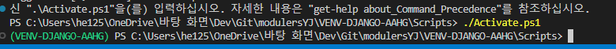
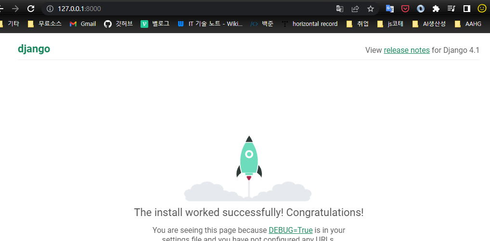
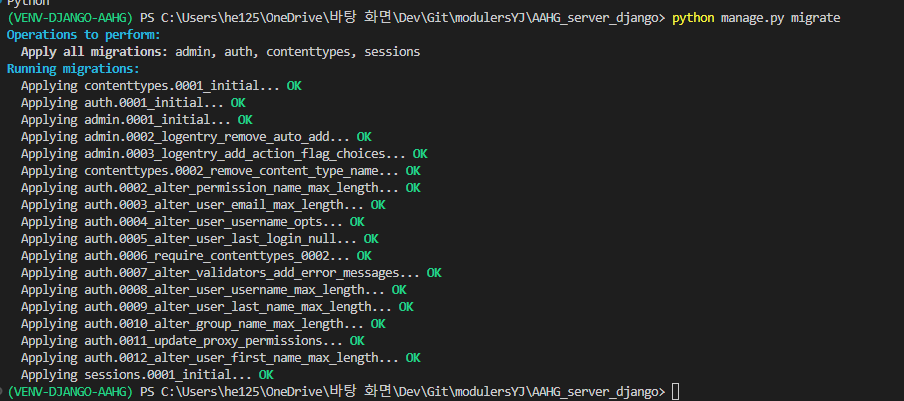
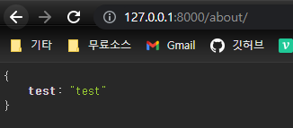

#### 장고관련 참고 총정리
https://velog.io/@he1256/Django-%EC%9E%A5%EA%B3%A0-%EC%B4%9D-%EC%A0%95%EB%A6%AC

<br><br>

---

<br><br>

## 베이스
https://pgnt.tistory.com/127

<br><br>

### 1. 윈도우- 파이썬 가상환경 활성화
https://dojang.io/mod/page/view.php?id=2470

1. Scripts 폴더 내 activate.bat 실행
2. activate.ps1 실행


<br><br>

### 2. Django 설치
1. 가상환경 내에서 `pip install django` 로 장고 설치
2. 장고 프레임워크 생성 (at 프로젝트 루트) : `django-admin startproject ${PJ_NAME}`
3. 가상환경 활성화 상태서, 생성된 장고서버 디렉터리 직하단(manage.py가 있는)에서
	- `python manage.py runserver` 실행하여 서버 구동 => 마이그레이션 적용 전이기에 경고
	- `127.0.0.1:8000` 포트로 장고 서버 구동 확인
  
	

<br><br>

4. 장고REST프레임워크
   1. python 가상환경 접속 상태에서 `pip install djangorestframework`로 설치
   2. `pip freeze`로 가상환경 내 패키지 및 버전 확인
   3. `python manage.py migrate`를 통해 마이그레이션 적용 : 경고 사라짐

	
	
	<br><br>

	4. 장고서버 PJ디렉 내 `settings.py`의 `INSTALLED_APPS`에 `rest_framework` 추가

<br><br>

### 3. 개발 착수
https://pgnt.tistory.com/129 따라가기 ㄱㄱ

1. utils, views 디렉 생성, 각각 디렉에 about.py 생성

2. `./urls.py`
```py
from django.contrib import admin
from django.urls import path
from AAHG_server_django.views.about import get_views_about

urlpatterns = [
    path('about/', get_views_about),
]

```

3. `./views/about.py`
```py
#rest
from django.http import HttpResponse, JsonResponse
from django.views.decorators.csrf import csrf_exempt
from rest_framework.parsers import JSONParser

from AAHG_server_django.utils.about import get_utils_about

def get_views_about(request):
    return JsonResponse(data= get_utils_about())
```

4. `./utils/about.py`
```py
def get_utils_about():
    return {'test': 'test'}
```


5. `127.0.0.1:8000/about` 요청 및 결과확인


